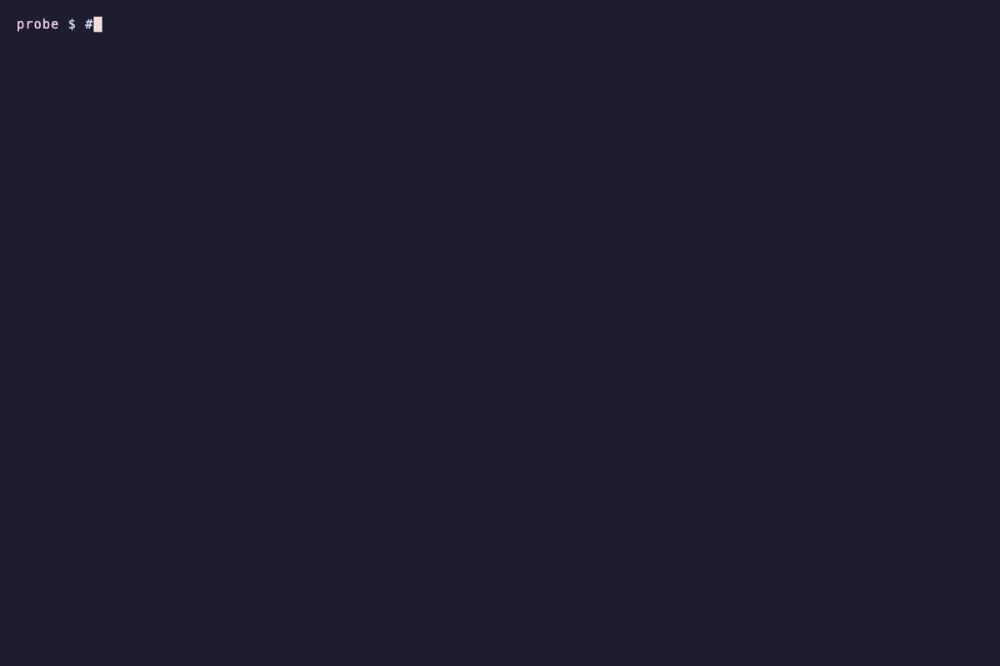
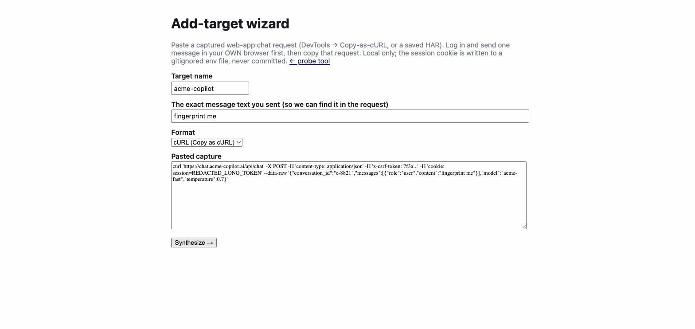
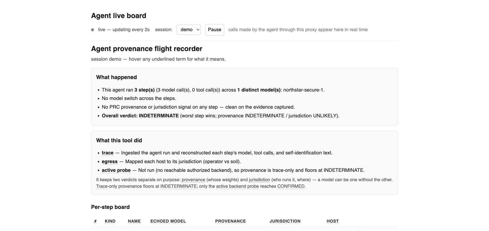

<div align="center">

# 🕵️ provenance-probe

### A lie detector for AI APIs — find out *which model is actually serving you*, and whether it's **Chinese-origin** or running under **PRC jurisdiction**.

Vendors can silently swap models, reroute your requests, or resell a Chinese model under a Western name. `provenance-probe` catches it with black-box measurements — **no vendor cooperation, no API key for the demo, runs 100% on your machine.**




*Above: a vendor's `northstar-secure-1` is fingerprinted as **Qwen2 (Chinese-origin), 20/20 exact match** — with no API key.*

</div>

---

## 🤔 The problem

When you pay for an AI model through an API, you're trusting the vendor to actually run what they advertise. They might quietly swap in a cheaper model, route your requests to someone else's servers, or resell a Chinese-made model under a Western-sounding name — and normally **you have no way to tell.**

That matters for two very different reasons, and this tool keeps them apart on purpose:

| Risk | The question | Why it bites |
|---|---|---|
| 🌏 **Jurisdiction** | Is inference executed by a PRC-domiciled operator or on PRC soil? | PIPL / DSL / CSL / National Intelligence Law Art. 7 — your data can be compelled |
| 🧬 **Provenance** | Are the model *weights* Chinese-origin, wherever they run? | Embedded alignment/censorship, poisoning, procurement policy |

A vendor can be clean on one and dirty on the other. Chinese open weights running **inside your own boundary** carry zero data-jurisdiction exposure — treating that as an egress problem misdirects your controls. So we never collapse the two into one verdict.

## 💡 How it works

The tool sends an endpoint a set of carefully chosen text snippets and watches **how the model chops text into tokens** — its tokenizer. Every model family does this slightly differently, like a fingerprint, and it's very hard to fake without breaking the service. That fingerprint (plus wire-headers, latency, behavioral and network signals) is matched against **27 real tokenizer families** to estimate provenance and jurisdiction — with an honest confidence label, never false certainty.

It reports in plain language first ("**this app uses an AI model built in China**"), technical evidence below, and can re-check an endpoint over time to catch a **silent swap months after you signed the contract.**

## ⚡ Quick start (60 seconds, no API key)

```bash
git clone https://github.com/lobster-shrimp/provenance-probe && cd provenance-probe
./install.sh                       # venv + install + pre-built reference vectors
source .venv/bin/activate
provenance-probe serve             # open http://127.0.0.1:8770
```

`install.sh` degrades gracefully — if HuggingFace is unreachable the install still succeeds (11 real tokenizer families ship pre-built). Try the exact demo from the GIF:

```bash
python mock_real_qwen.py &         # a fake "safe US model" that's really Qwen2
provenance-probe assess --config docs/media/demo-target.json --i-am-authorized --no-behavioral
```

## 📦 Install — Mac · Linux · Windows

<details open>
<summary><b>🍎 macOS / 🐧 Linux</b></summary>

```bash
git clone https://github.com/lobster-shrimp/provenance-probe && cd provenance-probe
./install.sh                       # one command: venv, package, reference vectors
source .venv/bin/activate
provenance-probe --help
```

Manual (if you want control):

```bash
python3 -m venv .venv && source .venv/bin/activate
pip install -e '.[reference]'      # '.[reference]' adds the tokenizer extras
provenance-probe build-reference   # optional: extend the reference corpus (needs HF access)
```
</details>

<details>
<summary><b>🪟 Windows (PowerShell)</b></summary>

**📖 Full walkthrough with prerequisites, WSL2 & Docker options, and troubleshooting: [docs/INSTALL-WINDOWS.md](docs/INSTALL-WINDOWS.md).**

**Prerequisites** (once): install **Python 3.12** (not the newest — best wheel coverage) and **Git**:

```powershell
winget install Python.Python.3.12
winget install Git.Git
```

Then, in a fresh PowerShell (`install.sh` is bash-only, so install manually — no C++ compiler needed, everything ships as wheels):

```powershell
git clone https://github.com/lobster-shrimp/provenance-probe; cd provenance-probe
py -3.12 -m venv .venv
.\.venv\Scripts\Activate.ps1        # if blocked: Set-ExecutionPolicy -Scope CurrentUser RemoteSigned
pip install --upgrade pip
pip install -e ".[reference]"
provenance-probe serve              # http://127.0.0.1:8770
```

The 11 GGUF-derived reference families ship pre-built, so you can probe immediately. Prefer a Linux-parity experience (one-command `./install.sh` + the full demo)? Use **WSL2** — see the guide.
</details>

<details>
<summary><b>🐳 Docker (any OS)</b></summary>

```bash
docker compose up --build                                   # binds 127.0.0.1:8770 only
docker compose exec provenance-probe provenance-probe build-reference
```

Reports persist to `/data` in the container (`~/.provenance-probe/reports` locally); override with `PROVENANCE_PROBE_HOME`.
</details>

## 🖥️ The local web UI

`provenance-probe serve` (binds to loopback, no auth — keep it local) gives you the whole harness in a browser:

- **Live probe tool** — endpoint + model → streamed multi-layer assessment → plain-language warning + technical report.
- **🧙 Add target** (`/wizard`) — **one box, no "which API style?"**. Paste a plain API address, a Copy-as-cURL, or a HAR: a URL is identified by *probing* it (OpenAI vs Anthropic auto-detected, behind an explicit consent gate); a capture auto-builds a web-app target. It dry-runs, offers a known-vendor key from your environment (the value never enters the config), and hands off to the probe tool prefilled.
- **🤖 Agent board** (`/agent`) — paste an agent trace (OpenTelemetry GenAI or minimal JSON) for a per-step provenance + model-switch + tool-egress board.



*The wizard synthesizes a `template` target from a pasted request — note it blanks the stateful `conversation_id` for replay-safety, flags the rotating CSRF header, and keeps the session cookie out of the config entirely.*

## 🧰 Commands

| Command | Purpose |
|---|---|
| `serve` | Local web UI (probe tool + add-target wizard + agent board) |
| `assess` | Full multi-layer assessment of a configured target |
| `agent-trace` / `agent` | Assess an **agent** (trace ingest, or active backend probe) |
| `sentinel` | Live reverse-proxy flight recorder — tees an agent's model calls, live board |
| `omniroute` | Fingerprint + cross-check a route through a local OmniRoute router (calibration-gated; confidence-capped until calibrated) |
| `redteam` | Drive an authorized endpoint through an adversarial corpus; detect a model switch |
| `monitor` | Diff two runs; **exit 2 on drift** — wire into CI to catch silent swaps |
| `build-reference` / `build-reference-endpoint` / `verify-reference` | Manage the tokenizer reference corpus |
| `init` | Write an example `targets.json` |

### 🛰️ Live agent flight recorder (`sentinel`)

Point an agent's `base_url` at the sentinel; it tees every model call, fingerprints in parallel, and serves a live board (`/agent/live`) that updates as calls arrive:



*The board ticks up live (3 → 4 steps here) with a plain-language "what happened / what the tool did" summary. A passive proxy can't run the tokenizer probe, so trace-only provenance honestly floors at INDETERMINATE — only the active backend probe reaches CONFIRMED.*

## 🔒 Scope & authorization

Only run against systems you are **authorized in writing** to test. Targets carry an `authorized` flag and active probing aborts without it. The behavioral probes send politically sensitive prompts — put that in your test authorization explicitly. API keys you enter are held in memory for the run and never written to report files; nothing is sent anywhere except the endpoint you name.

## 📚 Documentation

- **[WHITEPAPER.md](WHITEPAPER.md)** — the problem, the method, and why it's open (for consumers, security, legal/compliance, policy).
- **[QUICKSTART.md](QUICKSTART.md)** — project layout and first run.
- **[docs/adding-sources.md](docs/adding-sources.md)** — point the probe at a new API or web app.
- **[docs/EXTENDING.md](docs/EXTENDING.md)** — grow coverage: endpoints, web apps, agents, reference families.
- **[docs/CONOPS.md](docs/CONOPS.md)** — executive / federal concept of operations.
- **[DISCLOSURE.md](DISCLOSURE.md)** — the full-transparency publication policy.

## 🛰️ Companion — the Observatory

This repo is the **engine + CLI + local UI** (point-in-time, run it yourself). **[provenance-observatory](https://github.com/lobster-shrimp/provenance-observatory)** is the **continuous, public monitoring layer** built on the same core: nightly probes, a cosign/Rekor-signed append-only evidence log, numbered advisories, and a published site. Same fingerprinting engine, two use cases.
